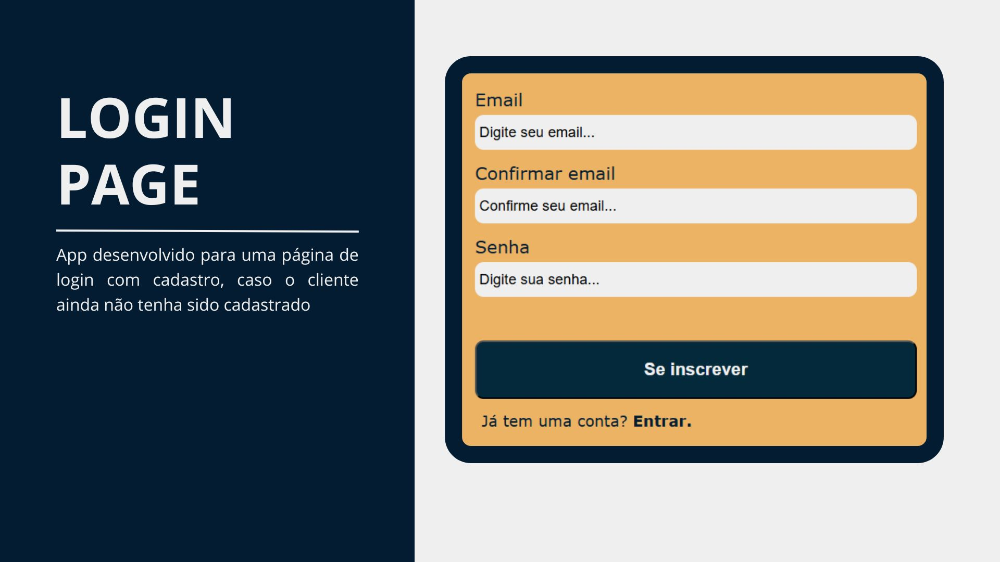

<h1 style="text-align: center">Login Page</h1>

App de página de login.

## <a href="#status">🚧 Status: Finalizado</a>

### Navegação

- <a href="#functionalities">⚙️ Funcionalidades</a>
- <a href="#tech">💻 Técnicas e tecnologias utilizadas</a>
- <a href="#acess">📁 Acesso ao projeto</a>
- <a href="#run">👨‍💻 Abrir e rodar o projeto</a>
- <a href="#licence">✅ Licença</a>

## <a id="functionalities">⚙️ Funcionalidades</a>

O aplicativo foi desenvolvido para projetar uma página inicial de login. Inciando com a página de signin para os clientes que já tem acesso e caso ainda não a página de registre-se para se cadastrar e acesso a home do app.

## <a id="tech">💻 Técnicas e tecnologias utilizadas</a>

React: usamos o React com JavaScript para criar o app e fazer suas funções e chamadas criando hooks e trabalhando com estados com usaState do react. Usamos também o react-roter-dom para criação do contexto geral do aplicativo e transitar informações entre os arquivos.

## <a id="acess">📁 Acesso ao projeto</a>

Você pode acessar o app clicando [link](http://example.com "Title").

## <a id="run">👨‍💻 Abrir e rodar o projeto</a>

Para abrir e rodar o projeto, basta clona-lo em sua máquina e abrir o aquivo, instalar suas dependencias com Node.Js e iniciar com o comando npm start.

## <a id="licence">✅ Licença</a>
MIT License   Copyright (c) 2025 Vagner Natividade   Permissão é concedida, gratuitamente, a qualquer pessoa que obtenha uma cópia deste software...